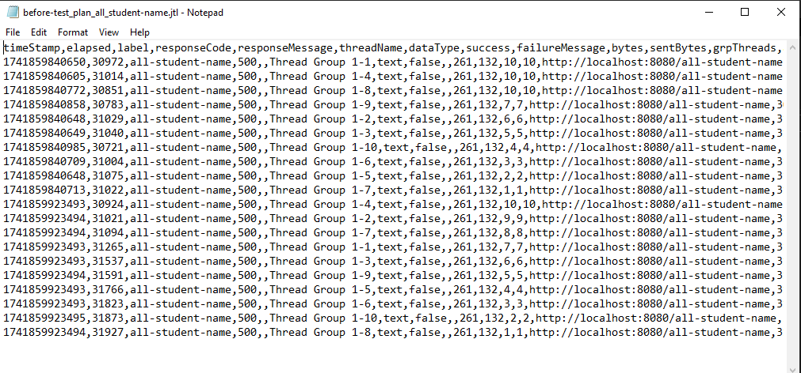

# Sebelum Optimasi

## /all-student

## /all-student-name

## /highest-gpa

# Setelah Optimasi

## /all-student

## /all-student-name

## /highest-gpa

# Performance Test Results and Conclusion

After completing the profiling and optimization process, we ran JMeter tests again for three endpoints. Below are the measured metrics before and after the optimizations:

---

## Endpoint: `/all-student`

- **Before Optimization:**
    - **Average Elapsed Time:** ~347,207 ms (≈347 seconds)
    - The test results showed response times ranging from approximately 330,936 ms to 359,590 ms.

- **After Optimization:**
    - **Average Elapsed Time:** ~3,318 ms (≈3.3 seconds)
    - The response times ranged between 3,078 ms and 3,475 ms.

**Improvement:** The response time improved dramatically (over 99% reduction), which indicates that the query optimizations and refactoring greatly reduced the processing time for this endpoint.

---

## Endpoint: `/all-student-name`

- **Before Optimization:**
    - **Average Elapsed Time:** Approximately 31,000 ms (≈31 seconds)
    - The measurements were consistently in the 30-second range.

- **After Optimization:**
    - **Average Elapsed Time:** Approximately 166 ms
    - The response times ranged from 89 ms to 296 ms, with an average around 166 ms.

**Improvement:** The response time for this endpoint was reduced by more than 99%, thanks to refactoring the string concatenation (using `Collectors.joining()`) which eliminated the inefficient loop-based concatenation.

---

## Endpoint: `/highest-gpa`

- **Before Optimization:**
    - **Average Elapsed Time:** ~134 ms
    - The elapsed times ranged from 83 ms to 187 ms.

- **After Optimization:**
    - **Average Elapsed Time:** ~19 ms
    - The response times were extremely low (between 6 ms and 69 ms, averaging around 19 ms).

**Improvement:** This endpoint saw an approximate 86% reduction in response time by leveraging a database query (`findTopByOrderByGpaDesc()`) to directly retrieve the highest GPA student instead of processing the entire list in memory.

---

## Conclusion

Based on the JMeter measurements, all three endpoints show a significant improvement in performance after the optimization process:

- **`/all-student`**: Reduced from ~347 seconds to ~3.3 seconds.
- **`/all-student-name`**: Reduced from ~31 seconds to ~166 milliseconds.
- **`/highest-gpa`**: Reduced from ~134 milliseconds to ~19 milliseconds.

These improvements confirm that the optimizations (such as using JOIN FETCH, stream-based joining, and database-level queries) were effective in reducing processing time and increasing throughput. The endpoints now respond much faster, ensuring a better user experience while maintaining the application's functionality.

---

